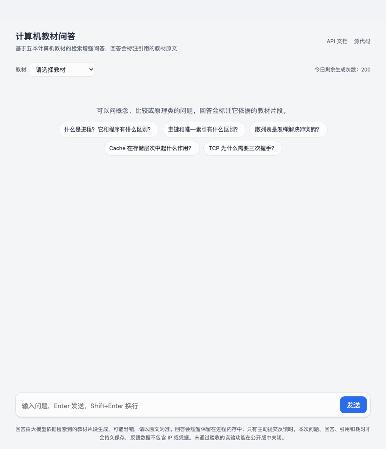

# 计算机教材 RAG 问答系统

[](https://github.com/Tanimasu/rag-textbook-qa/actions/workflows/ci.yml)

基于五本计算机专业教材（操作系统、计算机组成原理、计算机网络、数据结构、数据库）的检索增强问答系统。
回答里的每个结论都标注出处，点击编号就能对照教材原文。



<sub>本机运行录制：检索在 Mac 本地（MPS）完成，回答由 DeepSeek V4 Pro 生成。动图剪去了首字前约 16 秒的模型推理等待，
流式部分按 2.5 倍速播放。</sub>

## 特点

- **混合检索 + 重排**：BM25 与 `bge-large-zh-v1.5` 向量检索按名次（RRF）融合，再由 `bge-reranker-base`
  精排。BM25 用词加字符二元组分词，避免教材术语被切碎（散列表 → 散/列表）。
- **引用可追溯**：回答逐条标注资料编号，点击跳到原文；缺少编号或编号对不上时，页面会提示。
- **不掩盖教材矛盾**：一处已核实的教材自相矛盾（UNIQUE 允许几个 NULL），两侧原文都被检索到时，
  要求回答并列给出两种说法。
- **分层评测**：确定性的检索评测（Recall、MRR、nDCG，配对检验）用来迭代，RAGAS 只做阶段验收；
  调参只用开发集，留出集不参与。
- **本地或远程计算**：Embedding 和 Reranker 可以在 Mac（MPS/CPU）上跑，也可以交给 Windows GPU
  Worker；模型指纹不一致时直接报错，不会悄悄换模型。
- **可对外服务**：FastAPI 流式接口加聊天页，自带访问口令、按 IP 限流和每日生成额度；
  另有内置模型与索引的 Docker 镜像。

## 效果

检索（65 道标注题，不调用大模型）：

| 策略 | Recall@5 | MRR |
|------|----------|-----|
| BM25 | 0.677 | 0.484 |
| Embedding | 0.800 | 0.639 |
| Hybrid | 0.800 | 0.660 |
| Hybrid + Reranker | 0.877 | 0.687 |

配对检验下，只有「Hybrid + Reranker 优于纯 BM25」达到显著（p=0.001），其余差异不足以下结论。

回答质量（RAGAS，50 题；生成 `gemini-3-flash-preview`，评判 `claude-sonnet-4-6`，跨厂商以避免自我偏好）：

| Faithfulness | Answer Relevancy | Context Recall | Context Precision |
|---|---|---|---|
| 0.798 | 0.891 | 0.745 | 0.683 |

<sub>两张表都来自 2026-09 中旬之前的运行，早于上下文策略调整和两道标注修正，不能与之后的结果直接比较。
口径、复现方法和最新结果见[评测方法与结果](docs/evaluation-methodology.md)。</sub>

## 工作原理

```text
PDF ─→ Markdown ─→ 清洗 ─→ 按标题分块 ─→ ChromaDB（每本教材一个集合）
                                              │
       回答 ←─ LLM ←─ 上下文打包 ←─ 重排 ←─ 混合检索（向量 + BM25）
```

默认路径：用原问题做混合检索，重排后按 4000 字的预算打包上下文，交给大模型生成并标注引用。
HyDE、查询分解、引用核对和相邻片段补充都是实验功能，没有通过效果验收，默认关闭。

## 快速开始

需要 Python 3.11 / 3.12，以及 Conda 和 uv。

```bash
conda env create -f environment.yml && conda activate rag-textbook-qa
UV_PROJECT_ENVIRONMENT="$CONDA_PREFIX" uv sync --inexact --extra api --extra local-models
cp project/.env.example project/.env   # 填入 LLM_API_KEY、LLM_API_BASE、LLM_MODEL
rag-qa doctor                          # 只检查环境，不加载模型、不联网

# 每本教材建一次索引（首次会下载约 2.4 GB 模型）
rag-qa index build data/chunks/操作系统_mineru_chunks.json --book os
# 其余四本同理：database、data_structure、computer_organization、computer_network

rag-qa serve                           # 聊天页 http://127.0.0.1:8000，接口文档在 /docs
```

本地调试也可以用 Streamlit 工作台：`rag-qa app`（需要额外安装 `--extra ui`）。

## 文档

| 文档 | 内容 |
|------|------|
| [使用手册](docs/usage.md) | 安装配置、从 PDF 解析到建索引的完整流程、Streamlit 界面、评测命令 |
| [对外问答服务](docs/serving.md) | REST API、反馈收集、费用控制、Docker 镜像与部署 |
| [评测方法与结果](docs/evaluation-methodology.md) | 各层评测的口径、依据和历次结果 |
| [远程 Worker](docs/remote-worker.md) | 在 Windows GPU 上运行 Embedding 和 Reranker |
| [开发说明](docs/development.md) | 目录结构、CI、工具脚本、评测数据集 |

## 已知限制

- 检索评测都是按单本教材做的，"全部教材"一起检索的路径没有评测过，所以聊天页要求先选教材。
- 教材冲突保护只覆盖一处已核实的矛盾；没有提示，不代表教材在这一点上没有矛盾。
- 引用编号能对上，不等于每句话都有原文支撑。
- 首字要等 10–20 秒：生成模型会先做一段隐藏推理。

更多细节见[使用手册](docs/usage.md#当前行为与已知限制)。
