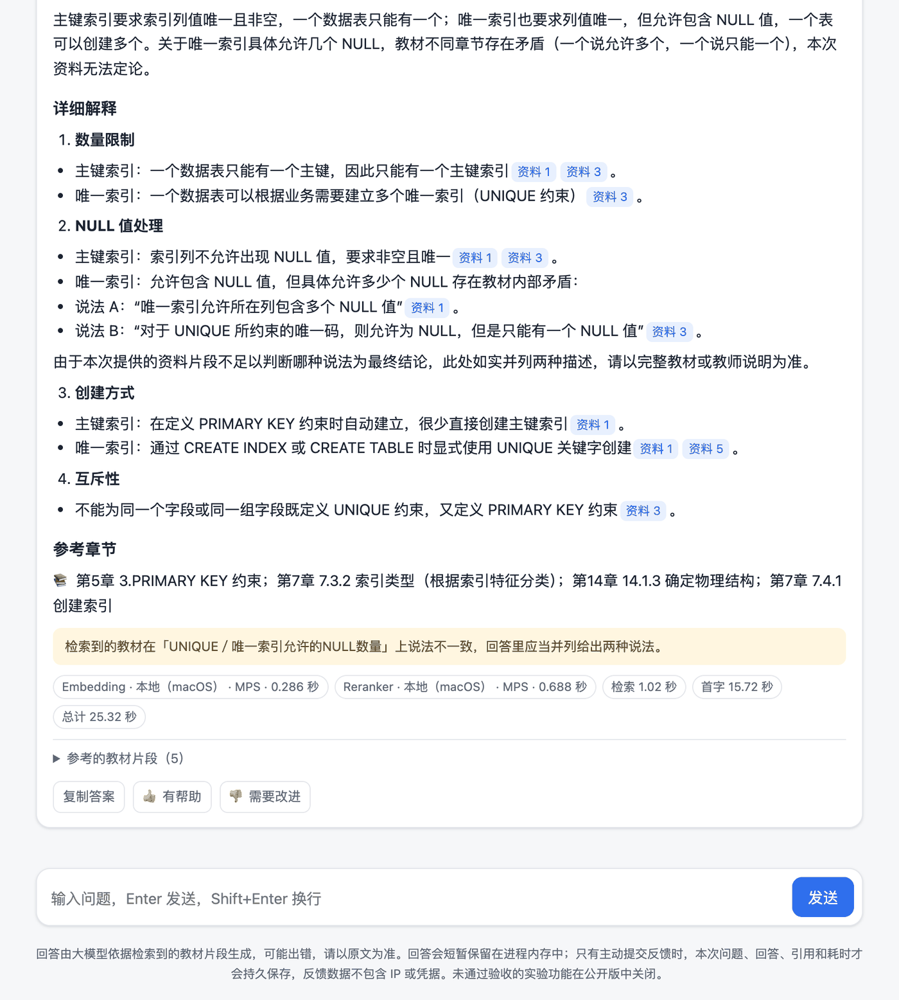

# 对外问答服务

```bash
uv sync --inexact --extra api --extra local-models
rag-qa serve                     # http://127.0.0.1:8000
```

一个进程同时提供聊天页（`/`）、REST API（`/v1/ask`、`/v1/ask/stream`、`/v1/books`、`/v1/feedback`）和自动生成的
接口文档（`/docs`）。公开接口只开放 `query`、`book_id`、`top_k`：查询分解、引用核对和 HyDE 一律关闭，
因为它们未通过验收且会额外调用模型；上游错误文本不会出现在任何响应里。



每次回答会得到一个随机、短期有效的 `answer_id`。页面提供复制、赞和踩；用户主动提交反馈后，
服务才会把这次问题、公开答案、公开引用、冲突提示、耗时和反馈持久保存到
`artifacts/product/feedback.sqlite3`。未提交的回答只在当前进程的有界内存中短暂保留；反馈数据不记录
IP、访问口令、API Key、Worker token 或模型内部提示词。该目录默认被 Git 忽略。

回答较慢时可以停止生成。浏览器一断开，服务端立即通知后台线程；模型每返回一个流式片段都会检查一次，
包括正文出现前的隐藏推理片段，随后关闭上游请求并释放单进程生成槽，仍在排队的请求直接放弃。已经发给
大模型的请求仍计入每日额度，尚未发出的会退回。等待期间每 10 秒发一次 SSE 注释保持连接。
失败、限流、断流或主动停止后可以一键重试原问题，
页面也可以直接清空当前对话；这些临时对话内容不会因为清空操作写入服务端。首页示例会自动选择对应
教材，当前浏览器标签页也会记住上次选择；没有索引的教材示例会保持禁用。

每次回答下方会显示 Embedding 和 Reranker 的实际执行位置、设备与耗时，例如 Windows 远程 CUDA，
或远程不可用后回退到 Mac 本地 MPS；这些信息来自本次请求的安全遥测，不包含 Worker 地址或凭据。

公开回答还会做零费用的引用编号完整性检查：没有引用编号，或引用了本次未展示的资料编号时，页面会明确
提醒。这个检查只保证编号能链接到下方教材片段，不代表每条陈述都已被原文支持；需要模型判断的引用核对
仍是默认关闭的实验功能。

需要检查或分析反馈时，可导出为 JSONL；默认不会覆盖已有文件：

```bash
# 先看不包含问题和答案正文的聚合摘要
rag-qa feedback summary

# 把负面反馈整理为待人工标注的候选，不会修改正式评测集
rag-qa feedback candidates --output artifacts/product/feedback-candidates.json

# 需要逐条分析时再导出明细
rag-qa feedback export --output artifacts/product/feedback-export.jsonl
# 明确需要覆盖同名文件时
rag-qa feedback export --output artifacts/product/feedback-export.jsonl --force
```

反馈用于后续人工归类和离线评测，不会在在线回答中自动运行 RAGAS，也不会自动改变检索参数。
候选文件中的 `relevant_sections`、`ground_truth` 和审核备注默认留空；只有人工对照教材完成标注后，
才应另行迁移到正式评测集，避免随手差评污染实验数据。“速度太慢”会标记为性能检查候选，
不应当迁移成回答质量题。

对外开放前要配好费用控制，全部通过环境变量：

| 变量 | 默认 | 作用 |
|---|---|---|
| `RAG_QA_ACCESS_CODE` | 不设 | 访问口令（仅 ASCII），放在请求头 `X-Access-Code` |
| `RAG_QA_RATE_LIMIT` / `RAG_QA_RATE_WINDOW_SECONDS` | 10 / 600 | 每个 IP 的提问滑动窗口限流 |
| `RAG_QA_FEEDBACK_RATE_LIMIT` | 30 | 同一窗口内单独计算的反馈提交限流，不占用提问次数 |
| `RAG_QA_DAILY_GENERATIONS` | 200 | 每日生成上限，用完后只返回检索到的原文、不调用大模型 |
| `RAG_QA_TRUST_PROXY` | false | 前面恰有一层可信代理时才开启 |

监听非本机地址时，必须设置 `RAG_QA_ACCESS_CODE`，或显式加 `--public` 确认无口令开放。
计数器存在进程内存里，重启即清零，只适合单进程演示。

## Docker 与 Hugging Face Spaces

镜像内置 CPU 版 PyTorch、固定版本的两个检索模型和当前索引，运行时不访问模型仓库，构建时会离线
加载一次模型，缺文件直接构建失败。大模型通过环境变量接入，不配置也能以“只检索”模式运行。
构建上下文是白名单，`project/.env` 不会进入镜像。

```bash
docker build -t rag-textbook-qa .
docker run -p 7860:7860 -e LLM_API_KEY -e LLM_API_BASE -e LLM_MODEL rag-textbook-qa
```

部署到 Hugging Face Spaces 时，先生成 Space 目录。注意 Docker Space 需要 PRO 订阅（免费账号只能托管静态页面）：

```bash
python scripts/prepare_hf_space.py      # 检查索引后生成 artifacts/hf-space/
```

脚本会拒绝空集合、嵌入模型不一致或冲突锚点失效的索引，本身不上传任何内容；末尾打印的 `hf`
命令要用你自己的账号执行，之后在 Space 设置里配置 `LLM_API_KEY`（Secret）、`LLM_API_BASE`、
`LLM_MODEL`。镜像以 `--public` 无口令开放，费用靠限流和每日额度控制；设置 `RAG_QA_ACCESS_CODE`
即可改为口令访问。Space 的磁盘不持久，重启后反馈库会清空。
